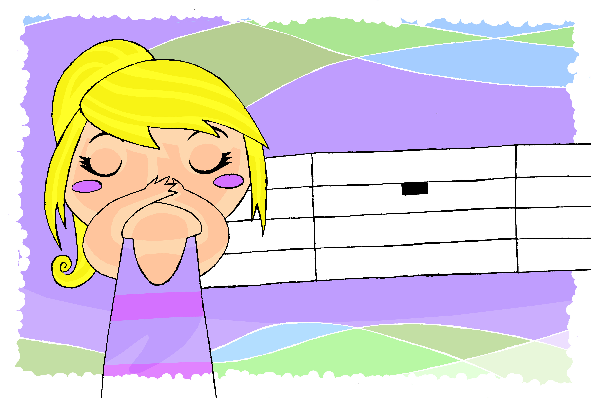

<!DOCTYPE html>
<html lang="pt">
  <head>
    <meta charset="UTF-8" />
    <meta http-equiv="X-UA-Compatible" content="IE=edge" />
    <meta name="viewport" content="width=device-width, initial-scale=1.0" />
    <link rel="stylesheet" href="style.css" />
    <title>Teste livro digital</title>
  </head>
  <body>
    

      

        

          

            
          

          

            
A menina não fala. Será que ela tem preguiça ou não tem língua?

          

          

            

              A menina não fala. Será que não ouve ou se faz de triste e
              esquecida?
            

          

        

      

      

        

          

            
          

          

            
A menina não fala. Será que ela tem preguiça ou não tem língua?

          

          

            

              A menina não fala. Será que não ouve ou se faz de triste e
              esquecida?
            

          

        

      

    

    
  </body>
</html>
